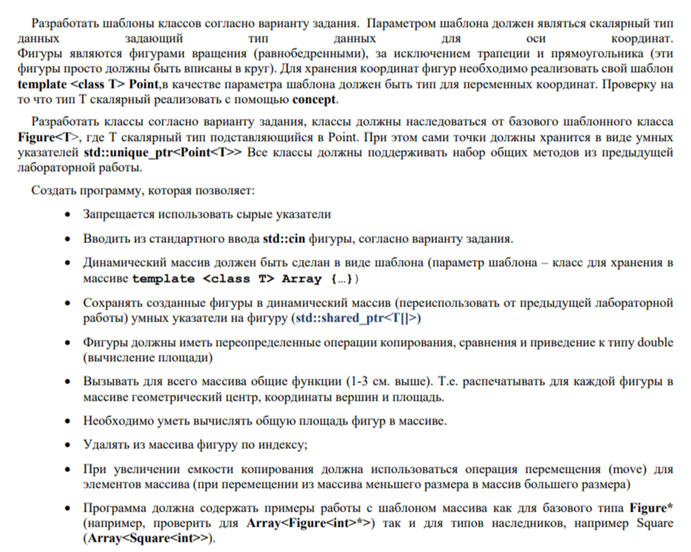

# ООП Лабораторная работа №4

М8О-211БВ-24: Губеев Давид Илембаевич
Вариант 28

Задание:
Трапеция, Ромб, 5-угольник

## Клонирование репозитория

```bash
git clone https://github.com/Dearale/OOP_Lab_4.git
```
## Запуск программы
```
mkdir build
cd build
cmake ..
make
./main_exe  # запуск программы
./tests      # запуск тестов
```
